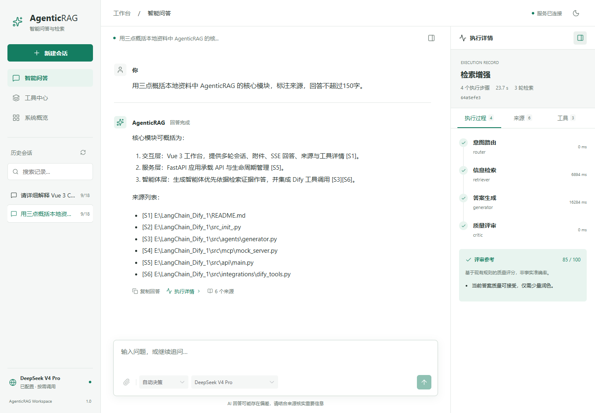

# AgenticRAG 智能问答与检索工作台

Vue 3 中文 AI 工作台，连接已有 Python/FastAPI AgenticRAG 执行链。提供多轮会话、图片附件、模型选择、真实 SSE 回答、停止生成、来源和工具详情、执行时间线与历史恢复。产品仅保留真实业务路径；没有凭据或调用失败时显示错误，不生成模拟成功回答。



## 安装与启动

已验证环境：Windows / PowerShell、Node.js 24.19、npm 11.6、Python 3.13。使用现有 npm 锁文件，不混用 pnpm。前端要求 Node >=24.15；Python 直接依赖约束见 `requirements-verified.txt`，不是全量跨平台锁文件。

```powershell
cd E:\AgenticRAG-Intelligent-QA-System
python -m venv .venv
.\.venv\Scripts\python.exe -m pip install -r requirements.txt -c requirements-verified.txt
cd frontend
npm ci
npm run build
cd ..
.\.venv\Scripts\python.exe src\api\main.py
```

访问 **http://127.0.0.1:8000/chat**。已有 `.venv` 时可直接构建、启动。构建后重启后端以挂载新资源。默认只监听本机，使用单 Uvicorn worker；尚无公网鉴权与多进程任务协调。

开发时保持后端运行，在另一个 PowerShell 中执行：

```powershell
cd E:\AgenticRAG-Intelligent-QA-System\frontend
npm run dev
```

访问 http://127.0.0.1:5173 。Vite 代理 `/api` 到 8000。端口占用时后端设置 `$env:PORT='8001'`；前端设置 `$env:VITE_API_TARGET='http://127.0.0.1:8001'` 并执行 `npm run dev -- --port 5174`。完整生产联动由 FastAPI 提供，`vite preview` 只作静态预览。

## 使用

1. 在系统概览检查模型档案。已配置不等于连接成功；成功调用记录来自本次后端启动后的实际回答。
2. 新建会话，选择模型及处理模式，输入问题。Enter 发送、Shift+Enter 换行；中文组合输入不会误发送。常用问题只填入输入框，由用户确认发送。
3. 支持图片的模型可添加 PNG/JPEG/WebP/GIF，每轮最多 4 张、每张 4MiB。能力来自后端配置声明，供应方实际支持情况仍须联调。
4. 回答过程中可停止。失败或取消会恢复输入，重试需手动发送。切换会话后原任务继续执行，返回原会话可停止。
5. 从回答下方打开执行详情，查看实际节点、轮次、来源、证据与工具结果。刷新恢复已保存历史；旧 JSON 会话可能没有运行元数据。
6. 工具中心支持搜索、协议筛选和 Schema 查看，系统概览支持刷新；两页不提供配置写入。

## 模型与数据

模型沿用 `config/config.yaml` 的 `model`、`model_profiles`。API Key 仅放后端 `.env` 或环境变量，按档案中的 `api_key_env` 配置；不要使用 `VITE_*` 保存凭据。可通过 `AGENTICRAG_CONFIG` 指向其他 YAML 配置。无需在聊天中提供密钥。

首次克隆后，在项目根目录执行 `Copy-Item .env.example .env`，填入自己的后端凭据。本仓库的配置不包含密钥，也不包含私人会话或知识文档；未配置凭据时显示未配置状态。

OpenAI/DeepSeek 使用 AsyncOpenAI 真实增量。`supports_streaming: false`、Ollama、Xinference 明确返回完整结果模式，阶段进度仍可见。问答失败不会自动重发，也不自动切换备用模型。原有规则路由和工具选择回退会在执行摘要中标识，不是模拟回答。Critic 是规则评审，修订可能产生额外模型调用。

SQLite 保存真实会话、消息、运行和事件；Chroma 保留混合检索。`system.memory_path` 为 JSON 时，在同目录创建 SQLite 并幂等导入，原文件不修改。配置目录、测试目录、退役样例不进入知识索引。

演示模式已退役：旧 `data/demo/`、`.cache/browser-demo/` 数据保留但应用不再读取；`mode=demo` 返回 422。浏览器旧模式键被移除，只迁移原 `rag-session-live` 指针到 `rag-session`。旧样例、旧截图的归档说明见 [接口与迁移](docs/api-and-storage.md)。

## 必要验证

默认测试不调用外部模型，不消耗 API 配额：

```powershell
cd frontend
npm run lint
npm run format:check
npm run smoke
npm run build
cd ..
.\.venv\Scripts\python.exe -B -m pytest tests/test_workbench_smoke.py -q
```

本机系统临时目录权限异常时，可追加 `--basetemp=.cache/pytest-唯一名称`，指定新的专用目录，避免 pytest 清理其他数据。

浏览器冒烟使用 `tests/browser_server.py` 和临时数据库，夹具仅存在于测试目录：

```powershell
cd frontend
$env:WORKBENCH_PYTHON='E:/AgenticRAG-Intelligent-QA-System/.venv/Scripts/python.exe'
$env:PLAYWRIGHT_CHANNEL='chrome'
npm run smoke:browser
```

无 Chrome 时安装 `npx playwright install chromium` 并移除 `PLAYWRIGHT_CHANNEL`。测试证据写 `frontend/test-results/evidence/`，不能当作真实模型截图。GitHub Actions 已配置，云端运行结果需推送后确认。

## 交付材料

- [前端设计、组件与生命周期](docs/frontend-design.md)
- [接口、SSE 协议、存储与迁移](docs/api-and-storage.md)
- [实际验证、性能数据与限制](docs/verification.md)
- [3～5 分钟操作展示脚本](docs/demo-script.md)
- [简历与面试材料](docs/career.md)
- [P2 功能与接口缺口](docs/roadmap.md)

原生页面保留 `/legacy`，API 文档在 `/docs`。Router、Planner、Retriever、Generator、Critic、HashEmbeddings/Chroma 检索、配置式知识图谱及 LangChain Runnable 是已有业务基础。MCP 是示例服务，Dify 仅有包装代码，不能据此声称完整插件发布或商业上线。

本仓库来自 [spark0v0/AgenticRAG](https://github.com/spark0v0/AgenticRAG) 的当前工作区改造版本，以独立初始提交发布，不携带旧仓库历史中的本地配置或数据。文档中提到的退役样例库、测试产物和本机缓存不随仓库分发。
