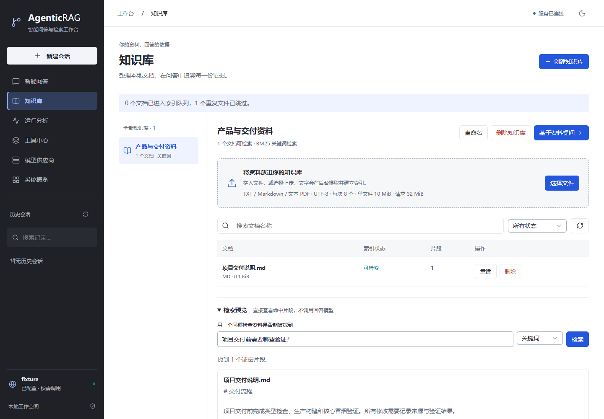
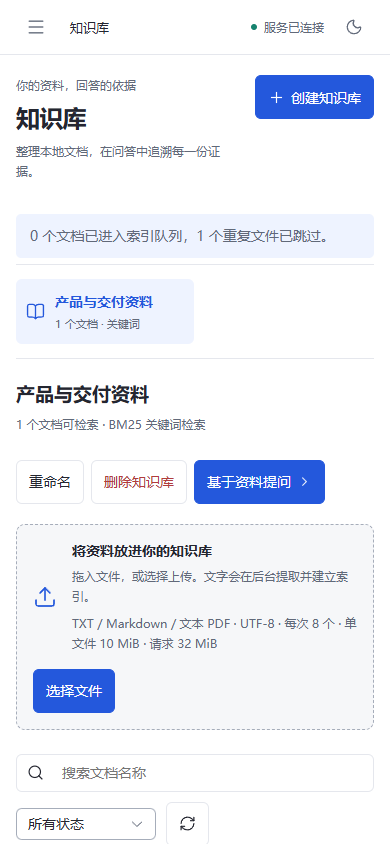
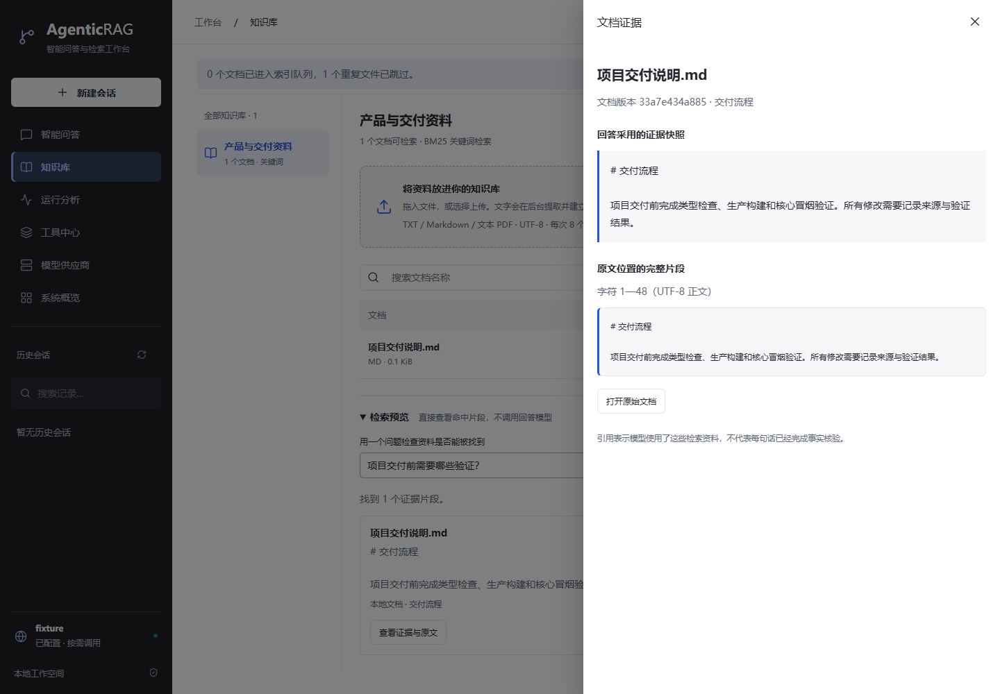

# 知识库交付验证记录

验证时间：2026-09-18；服务启动与实际页面复查：2026-09-19。所有检查均在本仓库工作目录执行。

## 实际通过的检查

| 检查 | 结果与范围 |
| --- | --- |
| 前端类型检查 | `vue-tsc --noEmit` 通过；生产构建再次包含类型检查 |
| Lint / 格式 | `npm run lint`、`npm run format:check` 通过 |
| 生产构建 | `npm run build` 通过；知识库路由独立 JS 15.39 kB，gzip 6.41 kB；独立证据组件 JS 7.67 kB，gzip 3.65 kB；不包含所有共享依赖，不能当作整页加载体积 |
| 前端核心逻辑 | `npm run smoke`：10 项通过；包括原 SSE/取消/安全渲染，以及新增会话知识库范围恢复、已删除库不静默切换 |
| 后端相关核心 | `test_knowledge_smoke.py`、`test_agent_upgrade.py`、`test_workbench_smoke.py`：18 项通过，1 条依赖警告；未扩展为全库或压力测试 |
| 浏览器闭环 | `knowledge.spec.ts`：1 条完整流程通过；真实 FastAPI 管理/上传/检索/持久化，回答供应商使用测试夹具 |
| 真实嵌入 | 模型下载完成，实际输出 512 维；`scripts/compare_knowledge.py` 成功建立真实 Chroma 向量并对比关键词/语义/融合 |
| 依赖 | 当前项目独立 `.venv`；`pip check` 返回 `No broken requirements found` |
| 补丁 | `git diff --check` 通过；Git 提示部分既有文件未来可能由 LF 转为 CRLF，不是补丁错误 |
| 实际服务 | `http://127.0.0.1:8000/knowledge` HTTP 200；`/api/knowledge` 可读；`/api/status` 返回 running |
| 实际浏览器 | Chrome 1440×1000、390×844；页面横向溢出均为 false；控制台/页面错误 0，失败网络响应 0；窄屏导航可操作 |

后端验证命令（临时目录必须是当前工作区内新建的独立路径）：

```powershell
$kbTestRoot = Join-Path (Get-Location) ('.cache/kb-check-' + [guid]::NewGuid().ToString('N'))
& .\.venv\Scripts\python.exe -m pytest tests/test_knowledge_smoke.py tests/test_agent_upgrade.py tests/test_workbench_smoke.py -q --tb=short --basetemp=$kbTestRoot
```

浏览器核心流程重跑：

```powershell
# frontend 目录
$env:WORKBENCH_PYTHON=(Resolve-Path ..\.venv\Scripts\python.exe).Path
$env:PLAYWRIGHT_CHANNEL='chrome'
# 本机默认临时目录曾有访问限制，使用项目内专用目录。
New-Item -ItemType Directory -Force ..\.cache\browser-temp | Out-Null
$env:TEMP=(Resolve-Path ..\.cache\browser-temp).Path
$env:TMP=$env:TEMP
npx playwright test tests/browser/knowledge.spec.ts --reporter=line --timeout=60000
```

不要同时手动占用测试端口 8010。脚本使用临时文件、会话库、知识库和供应商夹具；用户真实文件与配置不参与测试。当前常用服务使用 8000。

## 关键业务证据

- 上传前文件类型/内容、文件大小、请求大小和路径校验；PDF 解析位置确认为实际第 1 页，不捏造页码。
- 同库相同文件跳过；不同库允许保存相同文件；未提交索引不参与搜索；查询返回的库标识符合选择。
- 初次索引失败可重试、重复重试不会重复排队；取消后可重试；重启后的中断任务标记失败。
- 重建失败保留已提交的旧索引；删除与向量写入竞争时不发布已删除文档，相关向量与文件清理。
- 问答执行仅选中 `library_search`；来源保留文档与片段标识，并与最终回答一同持久化。
- 浏览器通过创建、上传、重复上传提示、检索预览、证据/原文面板、问答关联及删除后快照保持不变；桌面和窄屏截图已检查。
- 历史会话恢复知识库选择和检索范围；知识库消失时保留失效选择并要求重新选择，不回退至项目源码。

## 真实模型与夹具的区别

**真实执行：** TXT/Markdown/PDF 解析，SQLite 状态与工作队列，BM25，CPU BGE 语义推理，Chroma 向量检索，检索预览，FastAPI 上传和管理接口，Vue 页面渲染与交互。

**夹具执行：** 自动化中的回答生成和 SSE 上游使用已有 `tests/workbench_fixtures.py`；一个向量删除竞争检查使用明确标注的 512 维形状夹具，不能作为语义效果证据。真实语义效果的观察只来自独立的 `knowledge-retrieval-probe.json`。

三个固定问题的预期资料均排首位，关键词模式也命中相同首位；语义/融合会附带弱相关候选。没有足够样本支持准确率、召回率或改善比例结论，本轮不加入重排。记录中的毫秒耗时为热模型下小样本单次观测，未统计分位数，也不是端到端问答延迟。

当前实际服务保留现有供应商配置，但没有为了验证发起新的付费回答或 Tavily 请求。未把“供应商已配置”写成“真实问答已经联调成功”。

## 截图

以下截图来自隔离的通用资料夹具，不包含真实会话或密钥。侧栏中的 `fixture` 明确表示测试回答供应商。







## 已发现并处理的问题

- 默认 Windows pytest 临时目录拒绝访问：测试改用当前项目内独立临时目录，没有修改用户目录权限。
- 模型缓存软链接权限失败：公开模型管理库的备用下载源成功，实际推理确认维度；没有提高运行权限或回退哈希向量。
- 原规划测试假定简单问题也走模型规划：改成分别验证明确复杂上下文和简单模板路径，保持本轮减少不必要模型调用的要求。
- Element Plus 下拉框内部输入被展示层覆盖，测试改走正常键盘展开；文件输入通用样式排除组件库内部输入，避免尺寸干扰。
- 截图最初捕捉到动画中间状态：等待证据抽屉关闭，并使用 reduced-motion 重拍。最终截图不含动画遮罩。

## 未验证与已知限制

- 未使用真实付费回答供应商测试本轮“知识库 + Tavily”组合；范围控制、来源保存与流式链路采用隔离夹具验证。
- 未做海量文档、多用户、多个 Uvicorn worker、长时间压力或公网安全验证。队列是单进程单索引线程。
- 解析 PDF 页和执行 ONNX 批次不能即时强制中断；下一检查点取消，并禁止提交新 generation。
- 当前固定中文模型，变更模型或切分算法必须更新索引指纹并重建；没有热切换模型管理界面。
- 历史片段快照不等于事实核验；Critic 仍是低开销规则检查。
- CI 配置已加入知识库核心测试，但没有推送，因此未声称 GitHub Actions 云端运行通过。

后续建议：先使用自己的非敏感资料完成一次真实供应商联调，再根据误召回样本和规模需求决定中文分词、重排或索引结构优化；不自动扩展 OCR、权限、多租户、计费或工作流平台。
